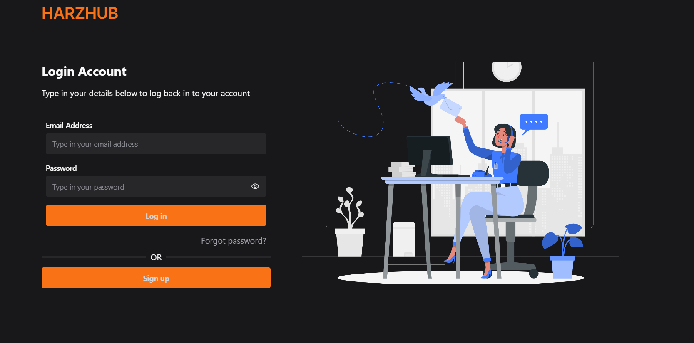

Airtime Ease - Simplifying Your Top-Ups & Bill Payments
Airtime Ease is a fast, secure, and user-friendly web application designed to make virtual top-ups effortless. With Airtime Ease, you can:

✅ Buy Airtime & Data for any network instantly
✅ Pay Utility Bills (electricity, water, TV subscriptions, etc.)
✅ Seamlessly Recharge Multiple Numbers in one go
✅ Enjoy Secure Transactions with reliable payment options

Whether you need to top up your mobile phone, subscribe to an internet plan, or pay essential bills, Airtime Ease ensures a hassle-free experience with a few clicks.

Get started today and simplify your digital payments! 🚀
